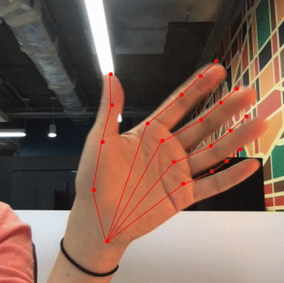

# Inleveropdracht Week 3

We gaan het K-Nearest-Neighbour algoritme gebruiken met input van een webcam. 

Je gaat werken met een array van *landmarks* (punten met x, y, z coördinaten) die gevonden worden in een gezicht of in een hand. Deze array wordt de input van je KNN algoritme. 

> ⚠️ Het algoritme heeft voor elk label meerdere voorbeelden nodig, om preciezer te kunnen voorspellen!

### Voorbeeld KNN

```javascript
let n = new KNN(3)
n.learn(landmarkarray, label)
n.learn(landmarkarray, label)
n.learn(landmarkarray, label)
let prediction = n.classify(landmarkarray)
```

## Inleveropdracht

- Bedenk een eenvoudige toepassing waarbij je de landmarks van FACE API of HANDPOSE API kan gebruiken.
- **Training** : sla de data (*landmark arrays*) op die bij verschillende uitdrukkingen of houdingen horen. Per pose heb je ongeveer 5~10 voorbeelden nodig. Let op dat de voorbeelden allemaal een beetje anders zijn. Dit is je training data. 
  - Voorbeeld: sla handposes op voor rock, paper, scissors.
- Roep het KNN algoritme aan met je training data en labels.
- **Predicting**: na training kan je nieuwe houdingen die de webcam ziet herkennen!
  - Voorbeeld: toon Emoji 👊, 🤚, 🖖 als een handpose herkend wordt op de webcam.


<br>
<br>

## Face API

De FACE API geeft een array van "landmark points" voor de belangrijkste features van je gezicht.


```javascript
// get face landmarks as array
const detections = await faceapi
        .detectAllFaces(video, new faceapi.TinyFaceDetectorOptions())
        .withFaceLandmarks();

// all positions in the first face
console.log(detections[0].landmarks.positions)        

// get specific features in the first face
const leftEye = detections[0].landmarks.getLeftEye()
const rightEye = detections[0].landmarks.getRightEye()
```
[Het voorbeeldproject vind je in de face-api map](./face-api).

<br>
<br>

## Handpose API

De HANDPOSE API geeft een array van "landmark points" voor de vingers van je hand in 3D.



```javascript
const predictions = await model.estimateHands(video)
if (predictions.length > 0) {
    const result = predictions[0].landmarks
    // x, y, z van de top van de wijsvinger:
    let y = predictions[0].landmarks[8][0]
    let x = predictions[0].landmarks[8][1]
    let z = predictions[0].landmarks[8][2]
}
```

[Het voorbeeldproject vind je in de handpose map](./handpose).

<br>
<br>

## Links

- [KNN week 3](./README.md)
- [Handpose API](https://github.com/tensorflow/tfjs-models/tree/master/handpose) en [tutorial](https://handsondeeplearning.com/a-quick-example-using-tensorflow-js-handpose-model/)
- [Face-api](https://github.com/justadudewhohacks/face-api.js/) 
- [Codepen KNN Demo](https://codepen.io/Qbrid/pen/OwpjLX)
- [KNear Github](https://github.com/NathanEpstein/KNear)
- [Uitleg K-Nearest-Neighbour](https://burakkanber.com/blog/machine-learning-in-js-k-nearest-neighbor-part-1/)

<br>